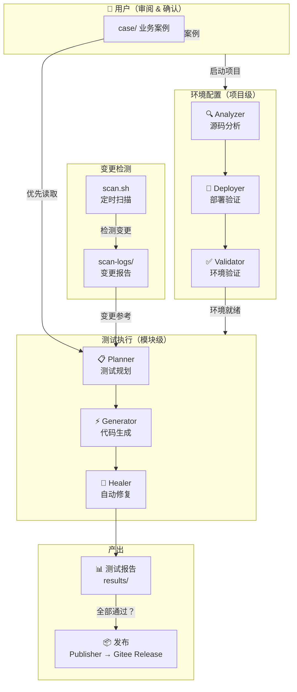
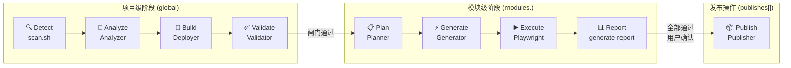

# PM - 自动化测试智能体中枢

PM（Project Manager）是一个 AI 驱动的自动化测试平台。它监控外部项目仓库的代码变更，通过多 Agent 协作自动生成测试计划、编写测试脚本、执行并修复失败的测试，最终将问题反馈回原项目。

核心思路：**人只做决策，Agent 做执行** —— 从变更检测到测试报告，全程由专职 Agent 分阶段完成，用户只需审阅和确认。

## 核心特性

| 特性 | 说明 |
|------|------|
| 仓库监控 | 定时扫描已注册项目，通过 `.last_hash` 比对自动检测新提交，含自动续签机制 |
| 用户案例驱动 | 用户可在 `case/` 目录放入业务案例文件，planner 优先读取并转化为测试计划 |
| 智能规划 | Planner Agent 浏览被测应用，自动探索页面结构和交互流程，生成 L2 API + L3 E2E 两级测试计划，同时录制 UI Map 供 Generator 直接生成代码 |
| 自动生成 | Generator Agent 读取计划中的 UI Map 直接生成代码（L3 E2E + L2 API），无需重新录制浏览器操作 |
| 自我修复 | Healer Agent 自动运行失败测试、定位根因、修复代码并验证通过 |
| 远程部署 | Deployer Agent 通过 SSH 在远程服务器部署环境，支持本地构建和远程部署两种模式 |
| 两级测试 | L2 接口测试（Vitest）+ L3 E2E 测试（Playwright），Planner 探索时同步标注 UI 问题到审查报告 |
| 可中断恢复 | 管线状态持久化（global 项目级 + modules 模块级 + publishes 历史），崩溃或中断后从断点继续 |

## 架构总览



### 九阶段流程

```
Detect → Analyze → Build → Validate → Plan → Generate → Execute → Report → Publish
 扫描    分析     构建    验证      规划    生成      执行      汇报      发布
```

| 阶段 | 作用域 | 说明 |
|------|--------|------|
| Detect | 项目级 | `scan.sh` 定时扫描，检测到变更生成报告到 `scan-logs/` |
| Analyze → Build → Validate | 项目级 | analyzer 分析源码 → deployer 验证部署能力 → validator 环境验证 |
| Plan → Generate → Execute → Report | 模块级 | 按模块独立追踪，互不覆盖 |
| Publish | 操作 | 全部通过后编译打包，上传到 Gitee Release，成功后写入 `publishes[]` 历史 |



### 目录结构

```
pm/
├── repository/                    # 外部项目只读克隆（gitignore）
│   ├── README.md                 # 项目注册表（scan.sh 管理）
│   └── <NN-Project>/              # Git clones，禁止修改源码
│       └── .last_hash             # 上次扫描的 commit hash
│
├── test_project/                  # 测试产物（gitignore，仅注册表提交）
│   ├── README.md                 # 测试工程注册表
│   └── <NN-Project>/
│       ├── playwright.config.ts   # 项目级 Playwright 配置（独立 baseURL）
│       ├── vitest.config.ts       # 项目级 Vitest 配置（L2 API 测试）
│       ├── plans/                 # 测试计划（00-test-plan.md + 模块详细计划）
│       ├── case/                  # 用户案例（planner 最高优先读取，禁止覆盖）
│       ├── test-config/
│       │   ├── environment.json   # 环境唯一真实来源（技术栈、端口、凭据、中间件）
│       │   └── auth.json          # 登录认证状态（seed 生成）
│       ├── tests/
│       │   ├── seed.spec.ts       # 登录种子（Planner/Generator/Healer 共享）
│       │   └── {api|e2e}/{module}/  # api/ + e2e/ 按模块分目录
│       │       └── tc-{编号}-{简称}.spec.ts
│       ├── .pipeline-state.json   # 管线状态（global/modules/publishes）
│       ├── build/                 # 构建部署产物（deployer agent 生成）
│       │   ├── version-log.json   # 构建版本追踪（追加式）
│       │   ├── deploy-config.json # 部署配置快照（可复用）
│       │   ├── nginx.conf         # Nginx 配置
│       │   └── artifacts/         # 构建归档（tar.gz + manifest.json）
│       ├── scan-logs/             # 变更报告（scan.sh 生成）
│       └── results/               # 测试执行结果（按模块分目录）
│           ├── summary.md         # 汇总报告
│           └── <module>/          # progress.txt + report.md + screenshots/
│
├── .claude/
│   ├── rules/                     # 项目规则（00-08，自动加载）
│   ├── agents/                    # Agent 定义（7 个专职 Agent）
│   ├── skills/pm/                 # /pm 项目注册管理 Skill
│   ├── skills/notify/             # /notify 通知管理 Skill
│   │   ├── SKILL.md
│   │   ├── notify.mjs
│   │   └── notify-config.example.json
│   └── scripts/                   # 工具脚本
│       ├── scan.sh               # 仓库扫描
│       ├── init-dirs.mjs         # 目录初始化（幂等）
│       ├── pipeline-state.mjs    # 管线状态管理（ESM）
│       └── generate-report.mjs   # Playwright 报告解析
│
├── .mcp.json                      # MCP Server 配置（Playwright + SSH）
├── playwright.config.ts           # Playwright 全局配置（参考模板）
└── package.json                   # Node.js 依赖
```

### Agent 协作

| 阶段 | Agent | 职责 | 输出 |
|------|-------|------|------|
| 分析 | **analyzer** | 只读分析源码、推断端口/技术栈/凭据、远程探测 | `environment.json.analyzer.*`、`playwright.config.ts` |
| 构建 | **deployer** | 验证部署能力：编译验证、归档、组装 dev/、远程部署（SSH） | `build/` 下全部产物、部署验证报告 |
| 验证 | **validator** | 环境验证、健康检查、出具报告 | 环境验证报告、`auth.json` |
| 规划 | **planner** | 优先读 case/ 用户案例，浏览应用，生成测试计划 | `plans/NN-{module}.md`（含 UI Map） |
| 生成 | **generator** | 按计划在浏览器录制操作、生成测试脚本 | `tests/{level}/{module}/tc-*.spec.ts` |
| 修复 | **healer** | 运行失败测试、定位错误、修复并验证（每 TC 最多 3 次） | 修复后的 `.spec.ts` + `results/` |
| 发布 | **publisher** | 编译打包前后端、上传到 Gitee Release | Tag + Release + 附件 |

### 关键设计

| 设计 | 说明 |
|------|------|
| 1:1 对应 | `repository/` 与 `test_project/` 条目一一对应（如 `01-RuoYi-Vue`） |
| 只读源码 | `repository/` 仅 `git clone` / `git pull`，禁止修改 |
| 案例优先 | planner 规划时 case/ > 变更报告 > 自主探索 |
| 约定大于配置 | 每个项目独立 `playwright.config.ts` + `environment.json`，首次测试时自动生成 |
| 可中断恢复 | `.pipeline-state.json` 记录状态（global + modules + publishes），新会话从断点继续 |
| 模块隔离 | 每个模块独立的 `progress.txt`、`report.md`、`screenshots/`，互不覆盖 |
| 归档不可删 | `build/artifacts/` 下每次构建的 tar.gz + manifest.json 永久保留 |

## 快速开始

### 1. 环境准备

```bash
npm install
npx playwright install chromium
```

OfficeCli（文档生成工具，可选）：

```bash
# Windows (PowerShell)
irm https://raw.githubusercontent.com/iOfficeAI/OfficeCLI/main/install.ps1 | iex
# macOS / Linux
curl -fsSL https://raw.githubusercontent.com/iOfficeAI/OfficeCLI/main/install.sh | bash
```

### 2. SSH 配置（远程部署时需要）

```bash
cp .env.example .env
# 编辑 .env 填写 SSH_SERVER_* 变量
```

配置格式：`SSH_SERVER_<NAME>_<FIELD>=value`

| 字段 | 说明 |
|------|------|
| HOST | 服务器地址 |
| USER | 登录用户名 |
| PASSWORD | 登录密码 |
| KEYPATH | SSH 密钥路径 |
| PORT | SSH 端口（默认 22） |
| PROXYJUMP | 跳板机地址 |

示例见 `.env.example`。

### 3. 注册项目

使用 `/pm` Skill 管理项目注册（自动双写两个注册表）：

| 命令 | 说明 |
|------|------|
| `/pm add [name] [url]` | 添加项目（自动扫描克隆仓库） |
| `/pm del <name>` | 删除项目（可选「彻底清理」） |
| `/pm list` | 列出已注册项目 |
| `/pm track <name> [dirs]` | 修改追踪目录 |

### 4. 放入用户案例（可选）

将业务案例文件放入 `test_project/<NN-Project>/case/`，planner 规划时会优先读取：

```
test_project/<NN-Project>/case/
├── 立项管理流程.md       # 任意格式，自由内容
└── 验收标准.txt
```

## 命令参考

### 仓库扫描

```bash
bash .claude/scripts/scan.sh              # 扫描所有项目
bash .claude/scripts/scan.sh <项目名>      # 扫描指定项目（支持部分匹配）
```

定时扫描（每天 12:00）通过 `CronCreate` 配置，含自动续签机制（7 天过期前自动重建）。

### 目录初始化

```bash
node .claude/scripts/init-dirs.mjs --project <NN-Project>
```

幂等脚本，自动创建 case/、plans/、tests/、test-config/、results/、scan-logs/、build/artifacts/ 目录。已有文件不覆盖。

### 管线状态初始化

```bash
node .claude/scripts/pipeline-state.mjs --project <NN-Project>
node .claude/scripts/pipeline-state.mjs --project <NN-Project> --dry-run
```

文件不存在 → 自动创建模板（global/modules/publishes 三段结构）；已存在 → 跳过。也可作为 ESM 模块导入：`import { readState, updateStage, appendPublish } from './pipeline-state.mjs'`。

### 测试执行

```bash
# L3 E2E 测试
npx playwright test --config=test_project/<NN-Project>/playwright.config.ts
# L2 API 测试
npx vitest run --config=test_project/<NN-Project>/vitest.config.ts
```

### 测试报告生成

```bash
node .claude/scripts/generate-report.mjs --project <NN-Project>
```

从 Playwright JSON 报告自动生成 results/ 下的 progress.txt、report.md、summary.md。

### 邮件通知

```bash
node .claude/skills/notify/notify.mjs --project <NN-Project>           # 有失败时发送
node .claude/skills/notify/notify.mjs --project <NN-Project> --dry-run # 仅预览不发送
```

| 配置项 | 说明 |
|--------|------|
| 配置文件 | `.claude/notify-config.json`（使用 `/notify setup` 配置） |
| SMTP 密码 | 已 gitignore |
| 默认行为 | 仅失败时发送（`sendOn.onFail: true`） |
| 项目级配置 | 在 `environment.json` 中添加 `notification.recipients` 数组 |

## 技术栈

| 组件 | 技术 |
|------|------|
| 测试框架 | Playwright（E2E/UI）+ Vitest（API） |
| Agent 通信 | MCP Server + Claude Code |
| 远程管理 | SSH MCP（37 个工具） |
| 配置语言 | TypeScript / JSON |
| 扫描脚本 | Bash |
| 版本管理 | Git + Gitee Release |

## 文档

| 文档 | 路径 |
|------|------|
| Agent 详情 | `docs/agents.md` |
| 项目规则索引 | `.claude/rules/00-README.md` |
| SSH 配置模板 | `.env.example` |
| 邮件通知 | `.claude/skills/notify/`（使用 `/notify setup` 配置） |

## 许可

ISC
